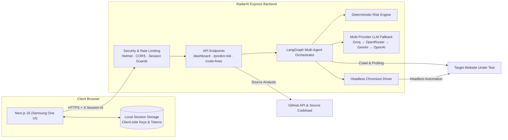
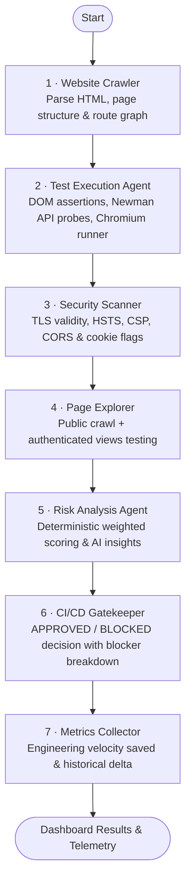

# RadarAI — Autonomous Quality & Release Intelligence Platform

> Autonomous Release Gatekeeper & Quality Intelligence Platform. Point RadarAI at a web application (and optionally its GitHub repository). A multi-agent LangGraph pipeline crawls endpoints, navigates authenticated views, executes headless Chromium browser and Newman API tests, checks cryptographic security policies, and computes a deterministic release risk score with line-level remediation fixes.


---

## Key Features

| Capability | How It Works |
|---|---|
| **Multi-Vector Test Execution** | Runs functional, SEO, accessibility, and performance evaluations on live DOM trees, headless Selenium Chromium browser sessions, Newman (Postman) API request suites, and a comprehensive TLS/header security audit. |
| **Autonomous Crawl Engine** | Recursively maps internal site structures up to 20 public routes with automatic link discovery and 404 direct-link detection. |
| **Authenticated Session Navigation** | Detects login portals, securely injects test credentials in browser memory, and audits up to 15 in-app authenticated views without submitting destructive forms. |
| **Deterministic Risk Formula** | Fixed, transparent release scoring engine: Functionality 35% · Security 30% · Performance 15% · Accessibility 10% · SEO 10%. |
| **Automated Deployment Gatekeeper** | Returns APPROVED or BLOCKED with specific release blockers (outages, broken routes, direct-link 404s, invalid SSL, critical defects). Can run inside GitHub Actions. |
| **Samsung One UI Design System** | Distinctive Two-Zone Viewing/Interaction layout, continuous squircle containers, radial device-care health rings, pill chips, and real-time radar visualizers. |
| **Code Intelligence & Line Fixes** | Analyzes the connected GitHub repository, correlates failed checks to source files, and produces line-level diff suggestions with projected risk reduction metrics. |
| **Ask Radar AI** | Conversational architectural assistant with source file references and failure mode insights. |
| **Run-to-Run Regression Tracking** | Compares release runs side-by-side to highlight newly passing checks, regressions, and velocity gains. |

---

## Architecture & Multi-Agent Pipeline

RadarAI orchestrates a stateful multi-agent pipeline using LangGraph:



### LangGraph Agent Execution Flow



---

## Design System

RadarAI interface features a minimal, matte design inspired by Samsung One UI:

1. **Two-Zone Ergonomics**: The top Viewing Area provides a clean, spacious summary of project health, gate status, and radar indicators, while the bottom Interaction Area places cards, filters, and actions within comfortable reach.
2. **Containerized Squircles**: Every card, widget, and diagnostic panel utilizes smooth continuous curvature (`border-radius: 20px - 28px`), isolating information cleanly.
3. **Radial Health Rings**: Visual status gauges inspired by device-care diagnostics display release risk, pass rates, and category distribution at a glance.
4. **Pill Navigation & Segmented Tabs**: Filter test results, inspect categories, and toggle options using pill-shaped controls.
5. **Matte Obsidian Palette**: Deep obsidian backdrop (`#0a0c10`), slate surfaces (`#13171f`), subtle hairline borders (`rgba(255, 255, 255, 0.07)`), and crisp status indicators.

---

## Deterministic Risk Formula

Release scores are calculated deterministically by [`backend/src/services/riskEngine.js`](backend/src/services/riskEngine.js):

$$\text{Overall Risk} = 0.35 \times \text{Func} + 0.30 \times \text{Sec} + 0.15 \times \text{Perf} + 0.10 \times \text{A11y} + 0.10 \times \text{SEO}$$

* **Severity Weights**: Critical = 5 · High = 3 · Medium = 2 · Low = 1.
* **Gate Decision — BLOCKED**: Triggered if any Release Blocker fails (start page unreachable, 404 direct-link failure, invalid SSL, critical defect), or if Functionality $\ge 50$, Security $\ge 60$, or Overall Risk $\ge 60$. Otherwise `APPROVED`.

---

## Quickstart & Local Setup

### Prerequisites
- Node.js 20+ (Node.js 22 recommended)
- npm 10+
- Google Chrome or Chromium (for local headless browser tests)

### 1. Clone the Repository
```bash
git clone https://github.com/rahul-1909/Radar-AI.git
cd Radar-AI
```

### 2. Install & Start Full-Stack App
```bash
# Install root dependencies
npm install

# Start both backend (port 5000) and frontend (port 3000) concurrently
npm run dev
```

Open [http://localhost:3000](http://localhost:3000) in your browser.

---

## Environment Configuration

### Backend (`backend/.env`)

```ini
PORT=5000
FRONTEND_URL=http://localhost:3000

# Optional AI Providers (Without keys, RadarAI operates in deterministic rule-based mode)
GROQ_API_KEY=
OPENROUTER_API_KEY=
GEMINI_API_KEY=
OPENAI_API_KEY=

# Optional: Higher GitHub API limit for repository intelligence
GITHUB_TOKEN=
```

### Frontend (`frontend/.env.local`)

```ini
NEXT_PUBLIC_API_URL=http://localhost:5000/api
```

---

## Production Deployment

### Option A: Render Blueprint (Backend) + Vercel (Frontend)
1. **Backend**: Connect this repository to [Render](https://render.com) using **New → Blueprint**. Render reads [`render.yaml`](render.yaml) and provisions the containerized service with Chromium included.
2. **Frontend**: Import the `/frontend` directory on [Vercel](https://vercel.com), add `NEXT_PUBLIC_API_URL=https://<your-render-service>.onrender.com/api`, and deploy.

### Option B: Docker
```bash
# Build backend container with Chromium
docker build -t radar-ai-api ./backend
docker run -p 5000:5000 -e FRONTEND_URL=http://localhost:3000 radar-ai-api
```

---

## Privacy & Security

- **Per-Session State**: Every browser session utilizes a unique `X-Session-Id` with isolated in-memory stores that automatically expire after 24 hours of inactivity.
- **SSRF Protection**: Built-in IP resolver guards against private/loopback URL access.
- **Credential Safety**: Injected test-account credentials and GitHub access tokens reside exclusively in local client memory and are transmitted per-request over HTTPS — never stored on disk.

---

## License

Distributed under the MIT License. See `LICENSE` for details.

Developed & Maintained by [Rahul](https://github.com/rahul-1909) · **[RadarAI Project](https://github.com/rahul-1909/Radar-AI)**
